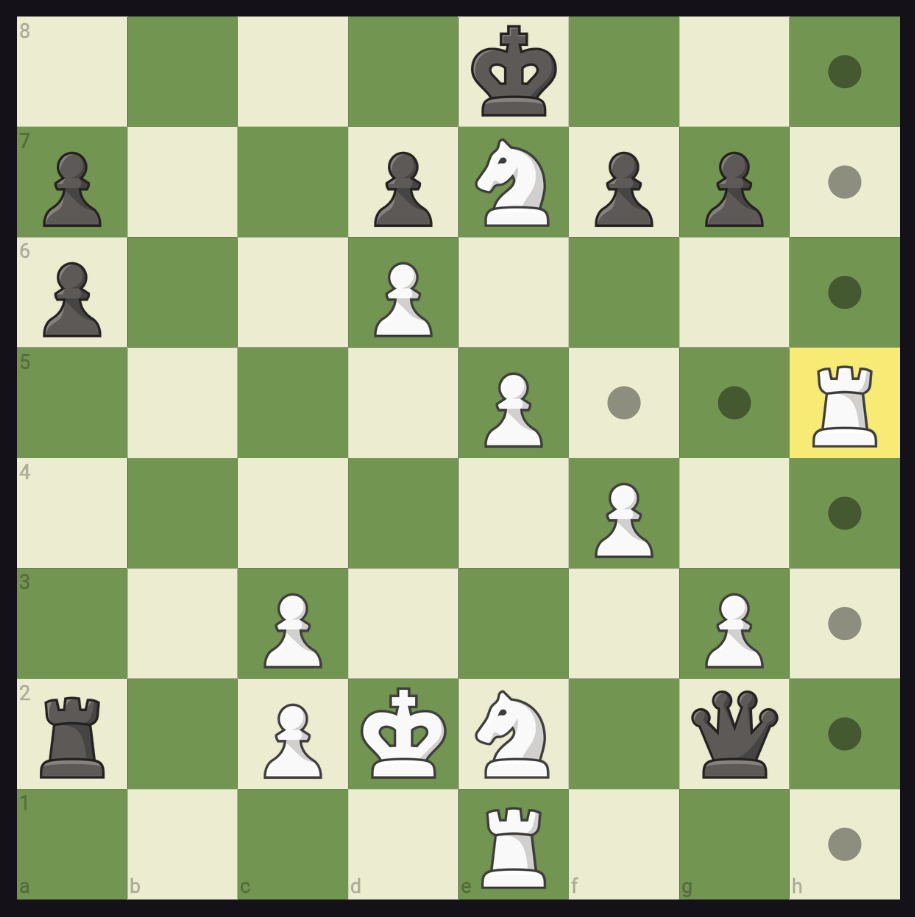
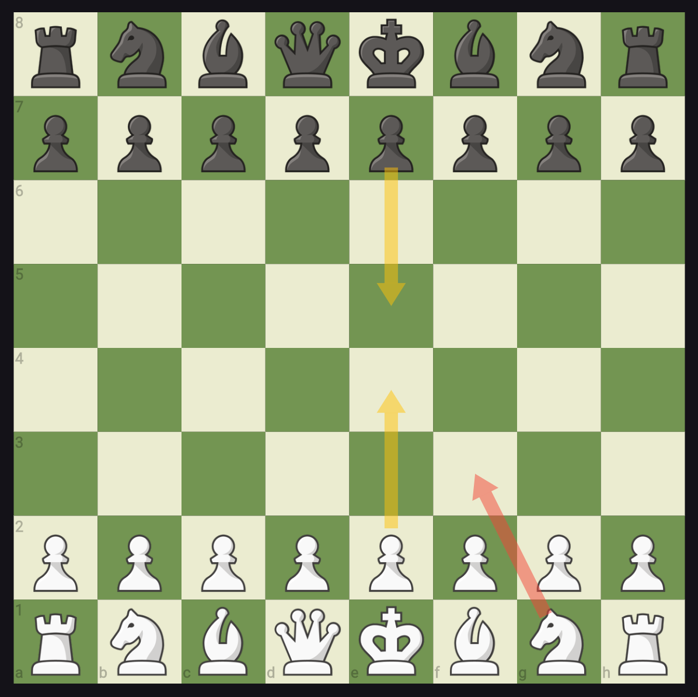

# advanced_chess_board

[](https://pub.dev/packages/advanced_chess_board)
[](LICENSE)

A customizable Flutter chess-board widget built from plain widgets (no pre-rendered
board images). Drag / tap to move, draw arrows, load FENs, and drive the board
through a `ChangeNotifier`-based `ChessBoardController`.




## Features

- Load any FEN into the board.
- Flip the board between white and black orientation.
- Toggle move input on/off for analysis/display boards.
- Move pieces by tap or drag, with legal-destination highlighting.
- Draw arrows over the board.
- Drive moves programmatically through `ChessBoardController`.
- Rich controller surface: `fen`, `playerColor`, `isInCheck`, `isCheckmate`,
  `isStalemate`, `isDraw`, `isGameOver`, `history`, `pgn`, `moveCount`.
- Widget auto-rebuilds on controller notifications — no
  `controller.addListener(setState)` boilerplate.
- Screen-reader support via `Semantics` wrappers on squares and pieces.

### Theming

Pass a `BoardTheme` preset or a custom theme to restyle every colour the board
paints with one value:

```dart
AdvancedChessBoard(
  controller: controller,
  boardTheme: BoardTheme.brown,
)
```

Five built-in presets: `classicGreen` (default), `brown`, `blue`, `purple`,
`monochrome`. Use `copyWith` for fine-grained overrides:

```dart
boardTheme: BoardTheme.classicGreen.copyWith(
  selectionColor: Colors.blue.withAlpha(155),
)
```

Legacy `lightSquareColor`, `darkSquareColor`, and `kingBackgroundColorOnCheckmate`
parameters still work and take precedence when explicitly passed.

### Piece sets

Swap the bundled Chess.com PNGs for a different piece set without forking the
package:

```dart
AdvancedChessBoard(
  controller: controller,
  pieceSet: PieceSet.fromAssetMap({
    (color: PlayerColor.white, type: chess.PieceType.KING):
        const AssetImage('assets/pieces/wk.png'),
    // ... all 12 (color, type) pairs
  }),
)
```

The default `PieceSet.chessDotCom` wraps the 12 `assets/pieces/*.png` files
bundled with this package.

### Coordinates

Toggle coordinate-label rendering mode:

```dart
AdvancedChessBoard(
  controller: controller,
  coordinates: CoordinateLabels.outside, // labels in gutters
)
```

Three modes: `inside` (3.0.0 default), `outside` (labels in gutters outside
the 8×8 grid), `none` (no labels). The `AspectRatio(1)` contract still applies
to the playing grid in every mode.

### Sound effects

Hook sound effects into moves without bundling audio assets:

```dart
class MySoundPack extends SoundPack {
  @override
  Future<void> play(SoundEvent event) async {
    // Route to your preferred audio backend, e.g. package:audioplayers.
    await audioPlayer.play(AssetSource('sounds/${event.name}.mp3'));
  }
}

AdvancedChessBoard(
  controller: controller,
  soundPack: MySoundPack(),
)
```

Priority order: `gameEnd > promote > castle > check > capture > move`. The
default `SilentSoundPack` produces no sound and has no audio dependencies.

### Hint arrows

Show an engine-suggested move arrow that auto-dismisses on the next move:

```dart
AdvancedChessBoard(
  controller: controller,
  hintArrow: HintArrow(
    startSquare: 'g1',
    endSquare: 'f3',
    duration: Duration(seconds: 4), // optional auto-dismiss
  ),
)
```

The hint arrow uses a dashed shaft and stroke-only outlined arrowhead in lime
green, visually distinct from user-drawn `ChessArrow`s.

### Drag legality indicator

The drag legality indicator fires automatically whenever `enableMoves: true`
(the default) and a drag is in progress. A thickened ring appears on legal
destination squares under the pointer; a translucent red tint appears on
non-source non-legal squares. Customise via `boardTheme.dragLegalRingColor`
and `boardTheme.dragIllegalTintColor`.

## Getting started

Add the dependency:

```yaml
dependencies:
  advanced_chess_board: ^3.0.0
```

Minimal import and widget placement — the barrel exposes everything you need:

```dart
import 'package:advanced_chess_board/advanced_chess_board.dart';

final controller = ChessBoardController();

// ...later in your build method:
AdvancedChessBoard(controller: controller)
```

## `AdvancedChessBoard` parameters

| Parameter | Type | Default | Description |
|-----------|------|---------|-------------|
| `controller` | `ChessBoardController` | required | State source for the board. |
| `boardOrientation` | `PlayerColor` | `PlayerColor.white` | Which side sits at the bottom of the board. |
| `lightSquareColor` | `Color` | `Color(0xFFEEEED2)` | Light-square background colour. |
| `darkSquareColor` | `Color` | `Color(0xFF769656)` | Dark-square background colour. |
| `kingBackgroundColorOnCheckmate` | `Color?` | `Colors.red.withAlpha(155)` | Tint placed behind the mated king. |
| `initialFEN` | `String?` | `null` | Optional starting FEN loaded on first build. |
| `enableMoves` | `bool` | `true` | When `false`, taps and drags are ignored. |
| `highlightLastMove` | `bool` | `true` | When `true`, the from/to squares of the last move are tinted yellow. |
| `arrows` | `List<ChessArrow>` | `const []` | Arrows painted on top of the board. |
| `moveAnimationDuration` | `Duration` | `Duration(milliseconds: 150)` | Duration of the tap / programmatic-move animation. Set `Duration.zero` to disable. |

## `ChessBoardController` getters

| Getter | Type | Description |
|--------|------|-------------|
| `fen` | `String` | Current FEN of the position. |
| `playerColor` | `PlayerColor` | Side to move. |
| `isInCheck` | `bool` | True when the side to move is in check. |
| `isCheckmate` | `bool` | True when the side to move is checkmated. |
| `isStalemate` | `bool` | True when the position is stalemate. |
| `isDraw` | `bool` | True when the position is drawn by rule. |
| `isGameOver` | `bool` | True when the game has ended by any rule. |
| `history` | `List<chess.State>` | Unmodifiable view of the move history. |
| `pgn` | `String` | Standard PGN of the game so far. |
| `moveCount` | `int` | Number of plies played. |
| `game` | `chess.Chess` | Escape hatch to the underlying `chess` engine. |

## Examples

### Drawing arrows

```dart
AdvancedChessBoard(
  controller: controller,
  arrows: [
    ChessArrow(startSquare: 'e2', endSquare: 'e4'),
    ChessArrow(startSquare: 'e7', endSquare: 'e5'),
    ChessArrow(
      startSquare: 'g1',
      endSquare: 'f3',
      color: Colors.red.withAlpha(128),
    ),
  ],
)
```

### Loading a FEN

```dart
controller.loadGameFromFEN(
  'r1bqkbnr/pppp1ppp/2n5/4p3/4P3/5N2/PPPP1PPP/RNBQKB1R w KQkq - 2 3',
);
```

### Flipping orientation

```dart
AdvancedChessBoard(
  controller: controller,
  boardOrientation: PlayerColor.black,
)
```

### Subscribing to controller notifications

The widget already rebuilds on controller changes. You only need to register a
listener if you want to run side effects outside the widget (analytics,
persistence, etc.):

```dart
controller.addListener(() {
  print('position changed: ${controller.fen}');
});
```

### Running a move programmatically

```dart
final accepted = controller.makeMove(from: 'e2', to: 'e4');
if (!accepted) {
  // illegal move — position is unchanged
}

// Skip the listener fan-out (e.g. when replaying a PGN).
controller.makeMove(from: 'e7', to: 'e5', notify: false);
```

## Migrating to 3.0.0

See the [CHANGELOG 3.0.0 entry](CHANGELOG.md) for the full list. Two
breaking changes to note:

- `ChessBoardController.isCheckmate()` is now a getter. Rename call sites
  from `controller.isCheckmate()` to `controller.isCheckmate`.
- Implementation files moved under `lib/src/`. Use the single top-level
  import `package:advanced_chess_board/advanced_chess_board.dart`, which
  re-exports `AdvancedChessBoard`, `ChessBoardController`, `ChessArrow`,
  and `PlayerColor`.

## Known limitations

- No built-in chess clock — wire your own `Ticker` / `Timer` against
  `controller.addListener`.
- Premoves are tracked in a separate spec (`chess-board-premoves`) and are
  not yet available.

## Credits

Piece images are sourced from Chess.com.
